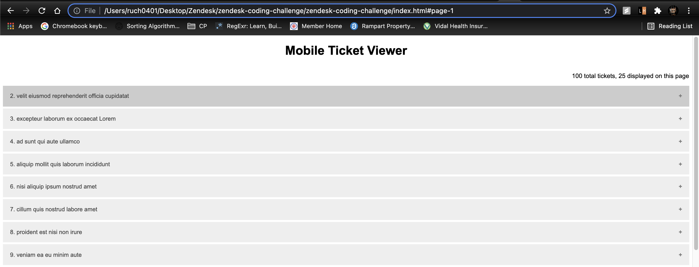
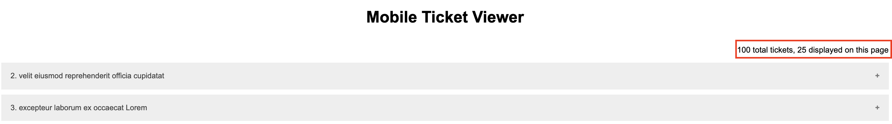
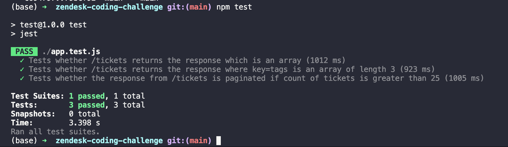

# Zendesk Coding Challenge

- Create a directory on your local machine named - zendesk-coding-challenge
- Run the following command -

```
git clone https://github.com/ruch0401/zendesk-coding-challenge.git
```

Prerequisites

```
Node JS
Zendesk Developer Account
```

- Download nodejs using https://nodejs.org/en/download/
- Download and update npm to the latest version using `npm install -g npm`
- Once downloaded and installed, check the versions of the downloaded modules using the following commands (run in the terminal)

```
node -v
npm -v
```

The output should be something like this -

|  |
| :---------------------------------------------------------------------------------: |
|                        <b>Checking node and npm versions</b>                        |

- Navigate to the `zendesk-coding-challenge` directory and open a terminal window here. The following steps have to be performed in this terminal window.

- Run the following commmand. This will install all the dependencies present in the `package.json` file.

```
npm install
```

- Once done, you need to create a new file named `.env`. Enter the following content in the file, save it and close it.

```
UNAME=<email-id-here>
PWORD=<password-here>
```

- Now, you have to start the server. In the terminal, run the following command

```
npm start
```

This will start the local server on port 3000

- Now, open the `index.html` file on your browser, preferrably, Google Chrome.

# Features

- You should be able to see a list view of the tickets available in your Zendesk's account

|  |
| :-------------------------------------------------------------------------------------: |
|                       <b>List of all tickets as an accordion</b>                        |

- If the number of tickets returned by the API is greater than 25, then the response is paginated, i.e. a single page will only have a list of 25 tickets

|  |
| :--------------------------------------------------: |
|   <b>Paginated result (when ticket count > 25)</b>   |

- You can see the count of the total number of tickets and the total tickets displayed on that page on the top right corner of the screen

|  |
| :-----------------------------------------------------------: |
|                   <b>Ticket list stats</b>                    |

- You can expand any accordion to view some critical information about a ticket.

|  |
| :-----------------------------------------------------------------------------: |
|                <b>Critical Information about a single ticket</b>                |

- In case of any error, the error message will be displayed on the webpage below the heading.

|  |
| :--------------------------------------------------------------: |
|                      <b>Error Handling</b>                       |

# Tests

Framework Used -

```
Jest
Supertest
```

- These would have been downlaoded automatically when you had previously run `npm install`

- Navigate to the `zendesk-coding-challenge` directory and run -

```
npm test
```

This will run the unit tests. As of now, there is one unit test which checks whether the response that is returned by the API has a key called `tags` and whether it is an array of size 3

|    |
| :-------------------------------------------------: |
| <b>Unit Test using Jest and Supertest Framework</b> |

- More tests are being continuously added.
